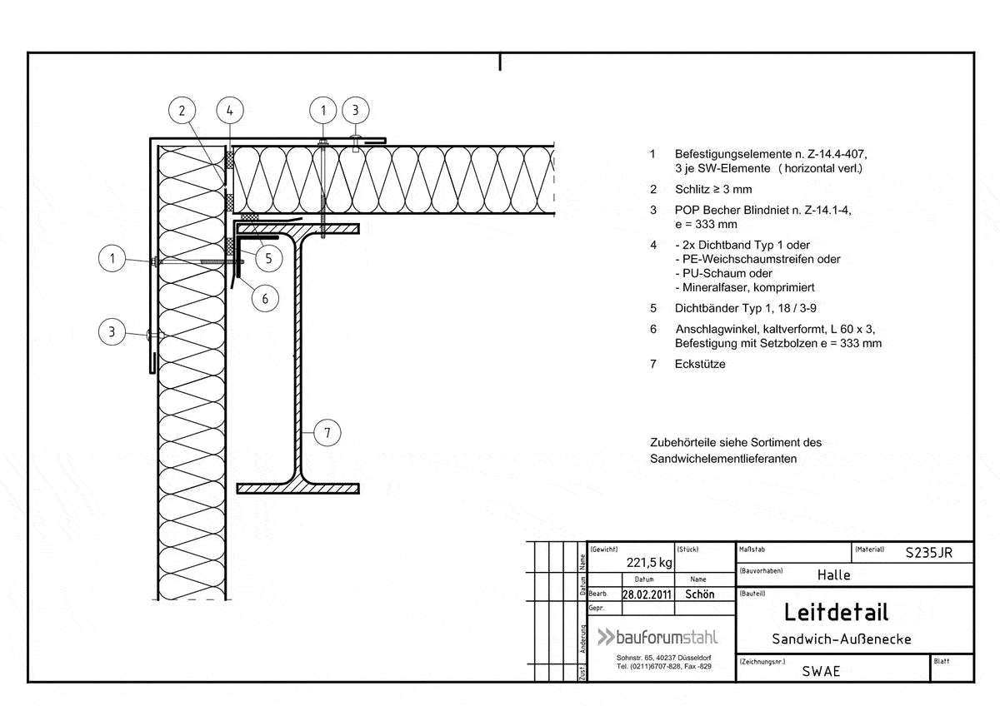
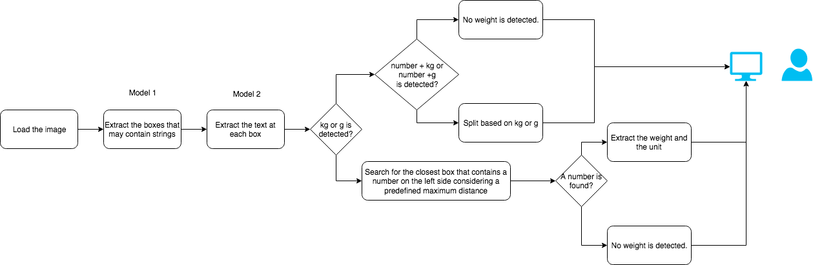
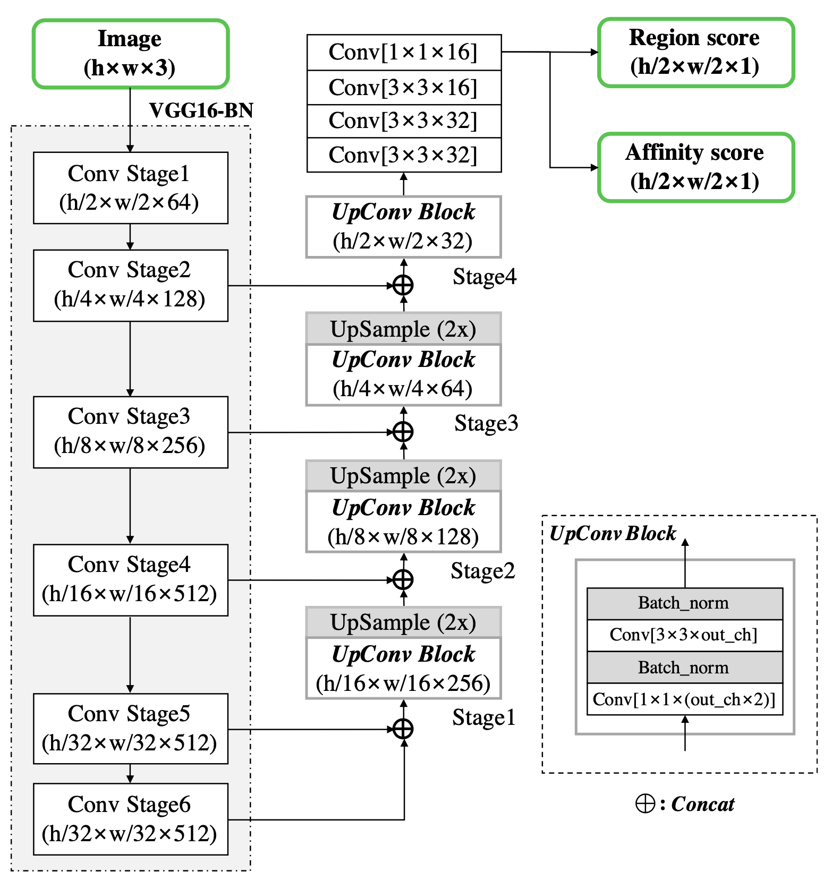
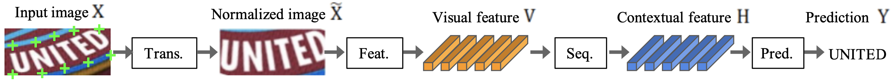

# Optical character recognition poc 

This is a proof of concept for the task of detecting weights in engineering 
drawings using deep learning models.  

The current solution uses a neural network model for the detection of text bounding boxes, and another 
model for the mapping of the bounding box content to text characters. 
An additional algorithm applied to list of bounding box locations and the corresponding text contents 
detects the weight units and weight values of the drawing.      

In general, this poc can be extended to extract more information, like the  
name of the element in the technical drawing, the date, the author etc.     
 
  


### Quick start

Clone the repository:
```bash
git clone https://github.com/KI-labs/ocr_poc
```
Create virtual environment and install the dependencies:
```bash
cd ocr_poc

pip3 install virtualenv
virtualenv venv
source venv/bin/activate

pip install -r requirements.txt
python setup.py install   

# download pretrained models 
gdown https://drive.google.com/uc?id=107K1g3LoU-XGd-skGtrpf5kav7nFPAeV \
    -O "./ocr_poc/text_detection/pretrained_model/craft_mlt_25k.pth"

gdown https://drive.google.com/uc?id=1r9FKpmtAld_YGaMXA7rfl02j6GI7wsK- \
    -O "./ocr_poc/text_recognition/pretrained_model/TPS-ResNet-BiLSTM-Attn-case-sensitive.pth"
```
Setup and run the flask app:
```bash
export FLASK_APP=ocr_poc/app:app 
export FLASK_ENV=development
flask run 
```
- You can upload only files with an `jpg`, `jpeg` extension.
- If a weight is detected, a green box will be drawn around the value and the unit and the value will be shown under the prediction field
on the right top corner. 


### Overview of the current solution

<p align="center">
  
</p>

The current solution is composed of several steps:

  - **Text detection**      
    We use a pretrained [CRAFT](https://github.com/clovaai/CRAFT-pytorch) 
    (Character Region Awareness For Text detection) neural network
    which detects the character regions and links the detected characters to text instances (one or several words).
    
    The network architecture is given in the image below. 
    It contains a feature pyramid network with a VGG-16 network used as a
    backbone. This type of the u-shaped feature generators have the property 
    of reliably catching features at all scales:    
      - the top-down part (the backbone) provides high resolution features   
      - the down-top part provides semantically strong features. 
    
    The final output has two channels as score maps: the region score and the 
    affinity score. The first  After applying a threshold function to them they are 
    converted to a single binary mask (the white-gray image in the gif file). 
    The isolated regions from these masks are detected with the use of a 
    [connected component labelling algorithm](https://sdm.lbl.gov/~kewu/ps/paa-final.pdf)
    and then mapped text bounding boxes. More information can be found 
    [here](ocr_poc/text_detection/README.md). 
    
        
    
    Image taken from [https://arxiv.org/pdf/1904.01941.pdf](https://arxiv.org/pdf/1904.01941.pdf).   

  - **Text recognition**   
    The text in each bounding box is recognized using a pretrained 
    [four stage STR](https://github.com/clovaai/deep-text-recognition-benchmark) (scene text recognition) network. 
    The network is composed of the following stages:    
     - transformation: we use a [Spatial transformer network](https://arxiv.org/pdf/1506.02025.pdf) (TPS). It 
     normalizes the input data by removing shape distortion effects like text rotation.         
     - feature extraction: we use a [ResNet](https://arxiv.org/pdf/1512.03385.pdf) - based architecture; 
     it is responsible for keeping the image 
     features that are relevant for character recognition and for filtering out the irrelevant features 
     (like color and font).     
     - sequence modeling: we use a Bidirectional LSTM network. It captures the context around every vertical stripe
     of the text image which helps later for the more robust characters prediction.        
     - prediction: we use an attention-based sequence prediction. It takes the sequence of contextual features and 
     maps it to a characters sequence.     
     
    More information can be found [here](ocr_poc/text_recognition/README.md).

        
    
    Image taken from [https://arxiv.org/abs/1904.01906](https://arxiv.org/abs/1904.01906).   


  - **Weight detection**    
    The 3rd layer analyzes the results in order to find weight-related information.
    At the moment, only weights in units of `kg` and `g` can be detected but 
    the logic can be extended in the future.
    
    The cases where the weight value and weight unit are in the same/different 
    bounding boxes are supported. For example, in case when the weight unit and
    weight value are in the same bounding box the following patterns can be 
    detected: `2.35 g`, `3.78 kg`, `7,87 kg`, `9 g`.
