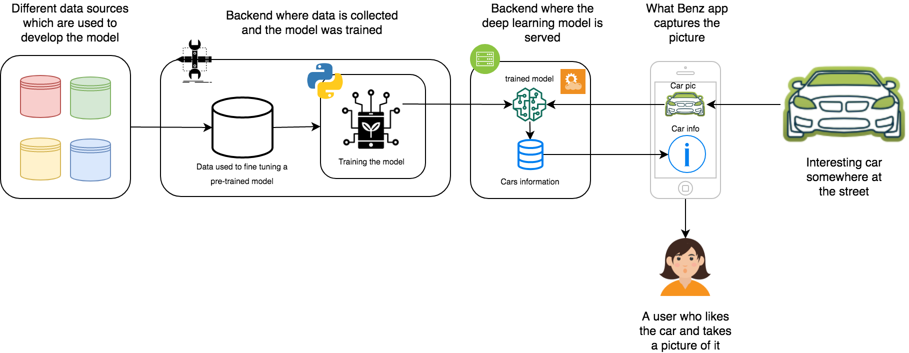
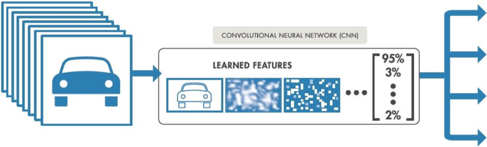
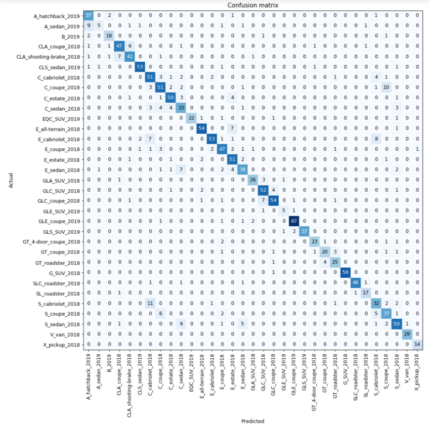

# what-benz-showcase
What Benz is a deep learning-based solution for recognizing Mercedes Benz cars from pictures taken using a mobile app

<p align="center">
    
</p>

## Introduction:
The variety and the similarities between the cars model make recognizing a particular car's model a challenge for many people.
Imagine a scenario where a person sees a car on the street, and he/she likes it. The person would take a picture of the vehicle, search for it somewhere on the internet or by asking a car dealer, explore some properties such as the engine, number of sets, possible colors, and finally get informed about the price range for different options.
What Benz saves you your valuable time and puts all that information just in a few seconds in your hand by just taking a picture of the car.

In this version of the app, we focused on developing a deep learning model that recognizes the new released Mercedes Benz cars during the last three years.

## How does it work?
It is straight forward. The user installs the app from the app store or through a link that we can send manually. The user runs the app on his/her phone and takes a picture of a car on the street. The app sends a request to the backend where the model runs. The model predicts the type of vehicle and sends back to the user the prediction together with all relevant information about this car's model.

## Workflow:

<p align="center">
    
</p>

## Technical overview:
### Pre-trained model
A standard pre-trained model, which is `ResNet34`, was used for the what benz app. The model was fined tuned using a custom dataset.
The original model was trained on the standard cars [Standford](https://ai.stanford.edu/~jkrause/cars/car_dataset.html) dataset.
The dataset contains 16,185 images of 196 classes of cars. The data is split into 8,144 training images and 8,041 testing images, where each class has been split roughly in a 50-50 split.

More information about `ResNet34` architecture can be found [here](https://github.com/pytorch/vision/blob/master/torchvision/models/resnet.py)

An Example about how to train the `ResNet34` model on the car Standford dataset can be found in this [Kaggle](https://www.kaggle.com/jupyternotebook/accuracy-85-with-fast-ai-in-4-epoches) kernel

<p align="center">
    
</p>

### Collecting data

For fine-tuning the model on new released Mercedes Benz car, we collected 10000 images for 33 new [Benz model classes](https://github.com/KI-labs/what-benz-showcase/tree/master/car-recognition-backend/outputs). 
Moreover, we used the [Mercedes Benz developer API](https://developer.mercedes-benz.com/) for fetching data about the existing cars at different European markets. 
The fetched data includes information about the available colors, engine power, fuel types, transmission types, and price range.

### Fine-tuning the model

Fine-tuning is the process in which parameters of a model must be adjusted very precisely in order to fit with the new collected image data.
The model was fined-tuned in two steps:
1. train the last layer on the new collected images
2. unfreeze all the layer and train the model on the new collected data

The quality of the fine-tuned model reaches 86% 


<p align="center">
    
</p>

<p align="center">
    
</p>

### Serving the model

After fine-tuning the model, Azure Machine Learning services were used to serve the model.
The model was saved in a `pkl` format in `AWS S3`. You can download the training weights using the following command:
 
```bash
wget https://car-recognition-labs.s3.eu-central-1.amazonaws.com/export_2.pkl
```

For more details about the model training, please check the [Jupyter notebooks](https://github.com/KI-labs/what-benz-showcase/blob/master/car-recognition-backend/notebooks/stanford-cars-dataset-with-accuracy-85-save.ipynb)  
   
The Jupyter notebook [`what_benz_classifier.ipynb`](https://github.com/KI-labs/what-benz-showcase/blob/master/car-recognition-backend/notebooks/what_benz_classifier.ipynb) demonstrates the steps that are necessary 
to deploy a model using `Azure ML Service`. Some requirements like registering/connecting 
to an Azure ML workspace are skipped.

### Tech stack
#### Data stack
- Python
- Flask
- fast.ai
- Azure ML services
- Jupyter notebooks

#### Mobile STACK
- iOS, Android Apps, Web version
- Flutter Framework
- Master Data Integration via API
- Beta build distribution via Testflight & Google Play
