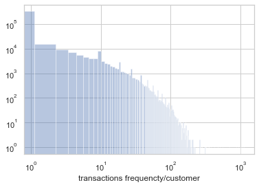

# Customer Lifetime Value (CLV): Real world use-case

## Introduction

In marketing, Customer Lifetime Value (CLV) is used as one of the most important metrics to measure the success of the business. CLV shows how much money the business owner should be spending on acquiring customers. In other words, CLV is showing how much value customers will bring to the business in the long run.
CLV helps business owners to focus on acquiring the right customers who are the primary factor in the success of the business in the future.
Calculating CLV depends on the business field and the business model. There is no straightforward method to calculate CLV for all cases. However, researchers developed a simple technique to estimate CLV using a simple set of available data. The simplified technique uses "Recency, Frequency and Monetary Value" RFM-framework to measure the value of each customer.
The RFM data can be calculated from the database easily. One can analyze data using simple tools such as Microsoft Excel. Another way to analyze data is to use a package such as "lifetime," which is implemented in python. The "lifetime" package provides flexibility and productivity by implementing several models to fit the data and visualize the results quickly.

## Dataset

The database we use contains transactional data of more than 450000 unique customers. In this blog, I use the "lifetime" package to analyze the data. Therefore, I extracted the RFM data based on the definitions given in the "lifetime" package's documentation.
recency: represents the age of the customer when they made their most recent purchases. This is equal to the duration between a customer's first purchase and their latest purchase. (Thus if they have made only 1 purchase, the recency is 0.) In this blog, the recency unit is weeks
frequency represents the number of repeat purchases the customer has made. This means that it's one less than the total number of purchases. This is actually slightly wrong. It's the count of time periods the customer had a purchase in. So if using days as units, then it's the count of days the customer had a purchase on. In this blog, I calculated the frequency as the count of the days -1.
monetary value represents the average value of a given customer's purchases. This is equal to the sum of all a customer's purchases divided by the total number of purchases. Note that the denominator here is different than the frequency described above.
Using the models that are provided by "lifetime" library, I need to get one more piece of information:
T represents the age of the customer in whatever time units chosen (weekly in this blog) This is equal to the duration between a customer's first purchase and the end of the period under study.

## Data Exploring

### Histograms
Since the dataset contains a wide range of values, I use the logarithmic scale to plot the data. 
The histogram of the frequency, figure 1, shows that many customers have 0 or 1 transaction frequency, 
which raises the question: does the business owner acquire many new customers, or an of those customers did not show up anymore?

<em>figure 1. The histogram of frequency in logarithmic scale</m>

The histogram of the recency, figure 2, shows that many of the customers have a recency fewer than 10 weeks. Putting it together with the histogram of the age 
T, figure 3, we can see that many of the old customers haven't shown up anymore. Active customers are mainly customers who are acquired recently.

The average spend (monetary value) histogram, figure 4, shows that most of the customers spend less than 1000 Euro on average. However, there are a considerable number of customers who spend much more than 1000 Euro on average. 
It is interesting to understand how such information affects the CLV values.