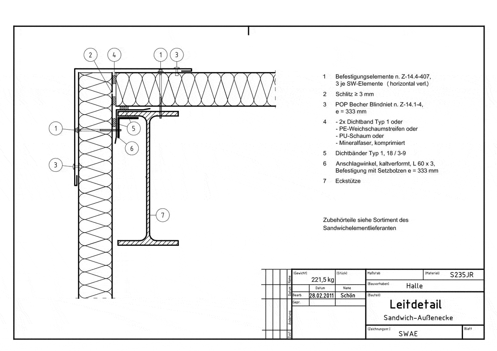
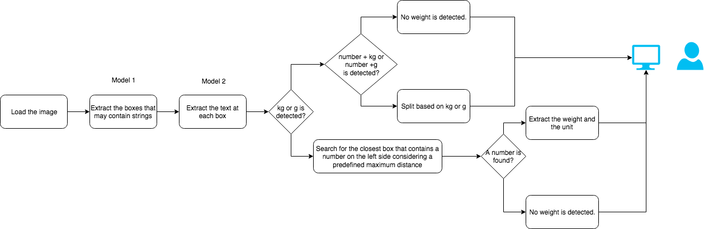
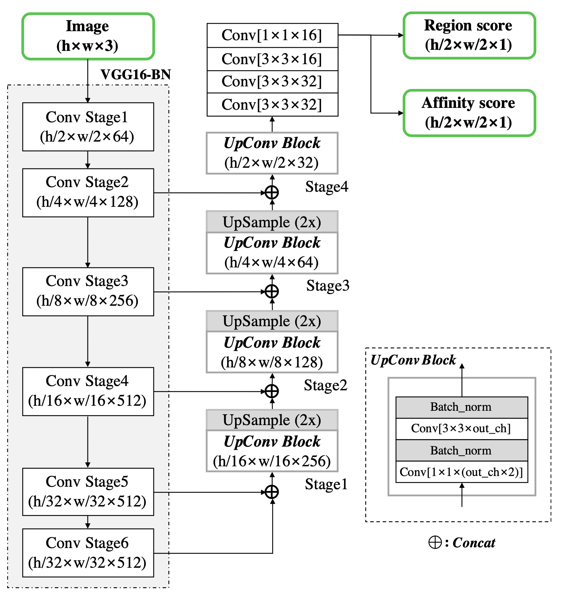
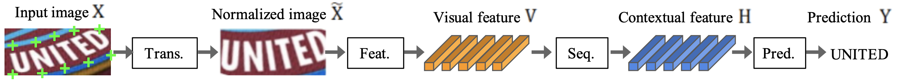

# Where Weight

*Where Weight* is a demo of an app that could be used for extracting information from engineering drawings.

## Introduction
Finding and getting information from unstructured data sources like images, drawings, scanned documents is a quite challenging and non-trivial task. Existing solutions like AutoCAD, Adobe or cloud OCR (Azure/AWS/GCP) don't work well enough for specific tasks because of their too generic approach.

Adopting a standard approach for the real-life situation may also require manual post-processing which makes document processing workflow not scalable. Or an addition preprocessing step to improve the quality of data extraction: sometimes an input document may have a poor resolution or could also be taken at a certain angle which makes generic approaches not applicable directly. 

This makes building an OCR (Optical Character Recognition) system for a specific goal relevant and actual task. It may require a complex approach for the entire problem and usage of different processing frameworks from classical Computer Vision to modern Deep Learning tools.

## How does it work?

*Where Weight* uses several deep learning network models for:
 - text bounding boxes detection 
 - mapping bounding box content to text characters
 
The solution also uses an additional algorithm that applies to a list of bounding box locations and the corresponding text contents and detects the weight units and weight values of the drawing.      

## Technical overview

  

*Where Weight* is composed of several steps:

  - **Text detection**      
    A pretrained [CRAFT](https://github.com/clovaai/CRAFT-pytorch) 
    (Character Region Awareness For Text detection) neural network
    which detects the character regions and links the detected characters to text instances (one or several words).
    
    The network architecture contains a feature pyramid network with a [VGG-16 network](https://arxiv.org/pdf/1904.01941.pdf) used as a backbone. This type of the u-shaped feature generators have the property of reliably catching features at all scales:    
      - the top-down part (the backbone) provides high resolution features   
      - the down-top part provides semantically strong features
    
    The final output has two channels as score maps: the region score and the 
    affinity score. The first  After applying a threshold function to them they are 
    converted to a single binary mask (the white-gray image in the gif file). 
    The isolated regions from these masks are detected with the use of a 
    [connected component labelling algorithm](https://sdm.lbl.gov/~kewu/ps/paa-final.pdf)
    and then mapped text bounding boxes.
    
        
    
  - **Text recognition**   
    The text in each bounding box is recognized using a pretrained 
    [four stage STR](https://github.com/clovaai/deep-text-recognition-benchmark) (scene text recognition) network. 
    The network is composed of the following stages:    
     - transformation: a [Spatial transformer network](https://arxiv.org/pdf/1506.02025.pdf) (TPS). It normalizes the input data by removing shape distortion effects like text rotation.         
     - feature extraction: a [ResNet](https://arxiv.org/pdf/1512.03385.pdf) - based architecture, responsible for keeping the image features that are relevant for character recognition and for filtering out the irrelevant features 
     (like color and font).     
     - sequence modeling: a [Bidirectional LSTM network](https://www.aclweb.org/anthology/Q16-1023/) which captures the context around every vertical stripe of the text image and helps later for the more robust characters prediction.        
     - prediction: an attention-based sequence prediction. It takes the sequence of contextual features and maps it to a characters sequence.     
     
   An [example](https://arxiv.org/abs/1904.01906) flow of scene text recognition with a model decomposition into four stages:  
     
       

  - **Weight detection**    
    The 3rd layer analyzes the results in order to find weight-related information. At the moment, only weights in units of `kg` and `g` can be detected but the logic can be extended in the future.
    
    The cases where the weight value and weight unit are in the same/different bounding boxes are supported. For example, in case when the weight unit and weight value are in the same bounding box the following patterns can be detected: `2.35 g`, `3.78 kg`, `7,87 kg`, `9 g`.

## Future improvements

In general, *Where Weight* solution can be extended to extract any specific information from a technical drawing: like the name of an element, a date, an author, key-value pairs, etc.

It's also possible to automate data extraction to scale document processing workflow and/or add some addition preprocessing steps to achieve better quality in recognition, for example, orientation detection, image rotation, etc.