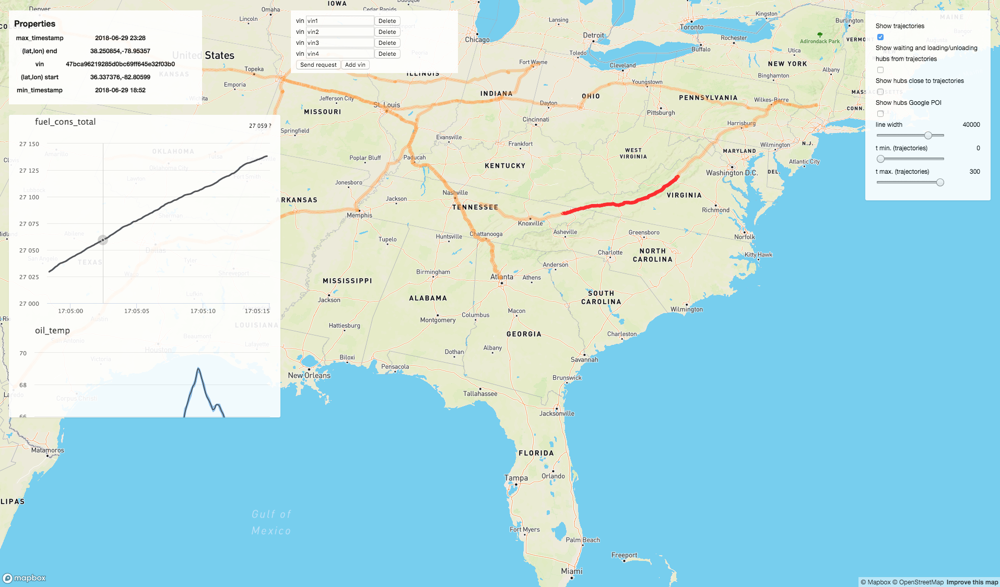
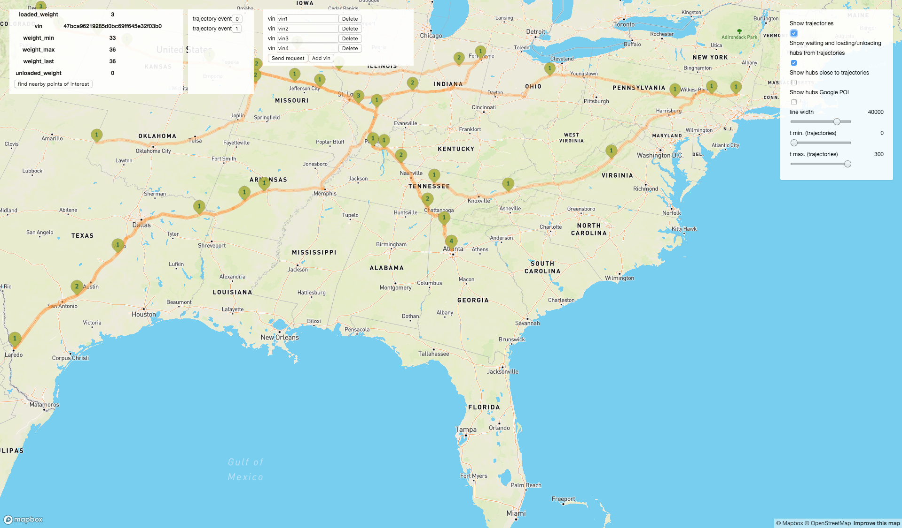
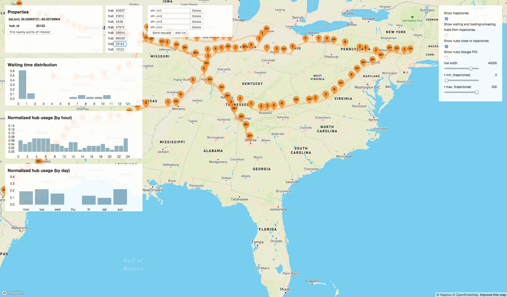
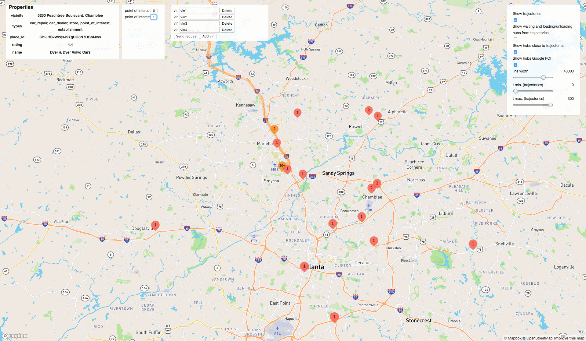
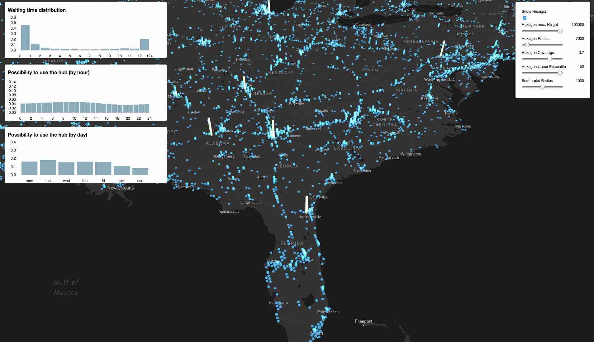

# Preprocessing and visualization of vehicle telematics data  

The task was to preprocess large amount of telematics data from vehicles and visualize it 
in a way that can allow business people to explore it. The data was stored in an Azure Data 
Lake. Data preprocessing scala/pyspark jobs were executed using an Azure Databricks 
platform. The size of the output data was significantly smaller than that of the 
input data which allowed us to store the results in a postgres database. For example, 
the output data could contain information about the places where the 
vehicles tend to stop, to fuel or to load/unload goods. 

The postGIS extension of a PostgreSQL DB allowed us to do efficient location queries. 
A typical example is finding points of interest within a given distance from a given point
or from a vehicle driving trajectory. To these results we can add results from using other 
APIs like Google Places. 

In order to allow the business people to explore the data we have created a React based 
UI. The rendering of the 3D graphics is done with libraries like 
[React-map-gl](https://uber.github.io/react-map-gl/#/) and [Deck-gl](https://deck.gl/#/).
Examples can be found in the screenshots below:

### Explore individual vehicle trips

 - Trajectory of a vehicle for a given time period     
    The trajectory is divided 
    into different segment based on events where the truck is idle for a long period of time.
    A business person can see the following information: 
    - vehicle telematics data (figures in the left panel) for a selected trajectory
    segment (trajectory highligted in dark red)
    - start/end time of a trip (trajectory) and vehicle id in the panel in the
    upper right corner; 
    - option to choose multiple vehicles from the top panel   
    - option to show/hide different layers of the graph: Google points of interest,
    most common stop locations among all vehicles, stop locations of the selected
    vehicle (right panel)
    - option to get data for a given time range (right panel)
     
    
     

 - Places where the selected vehicle has stopped  
    If several places are too close to each other they are visualized as a 
    single point (green dots on the map with a number equal to the number 
    of these places). You can see:     
    - a panel with trajectory events that appears if you select a point (in the figure below  
    a point with two such events is selected) 
    - a panel with information about the loaded/unloaded weight of a vehicle
     
    

 - Places where the vehicles tend to stop   
    If several places are too close to each other they are visualized as a 
    single point (orange dots on the map with a number equal to the number 
    of these places). You can see:   
    - a panel with trajectory events that appears if you select a point (
    in the current image a point with eight such events is selected)  
    - a panel with information about the "waiting time distribution", i.e. the duration for 
    which the vehicles that tend to stop at this place are idle.  
    - a panel with information about the hours in the day in which the selected place is occupied.  
    - a panel with information about the days in the week in which the selected place is occupied.
     
    
           

 - Google places   
   For every selected place the user has the option to get nearby places of a specific type (service). 
   These places are visualized as red dots.   
    
   

### Explore areas where vehicles tend to stop

For every selected hexagon the user can see:
   
 - a panel with information about the hours in the day in which the 
 selected area is occupied with idle vehicles.  
 - a panel with information about the days in the week in which the 
 selected area is occupied.
 - a panel with information about the amount of time for which the
 vehicles tend to stop in this area.
  
 