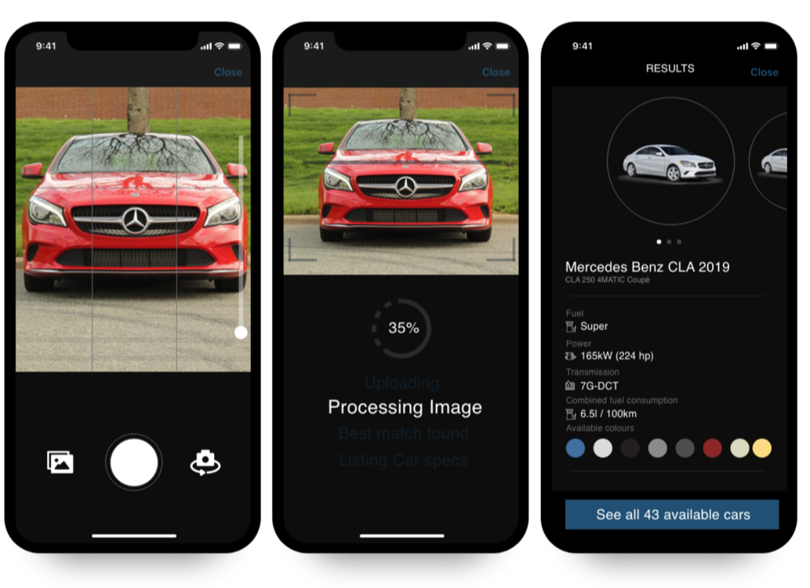
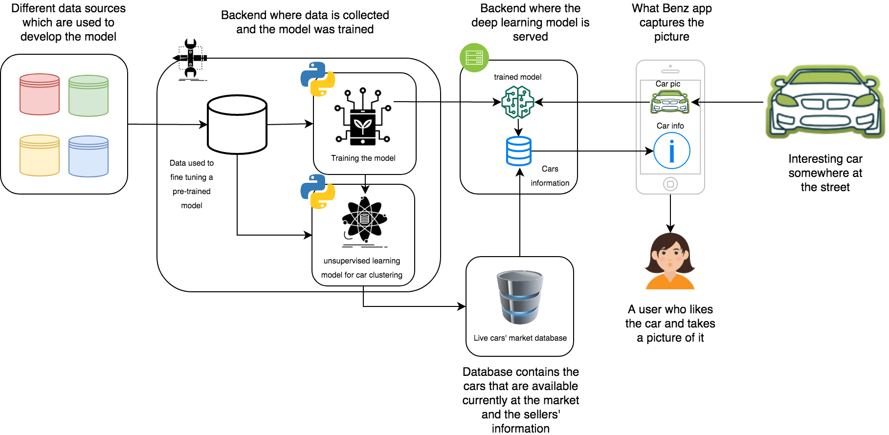
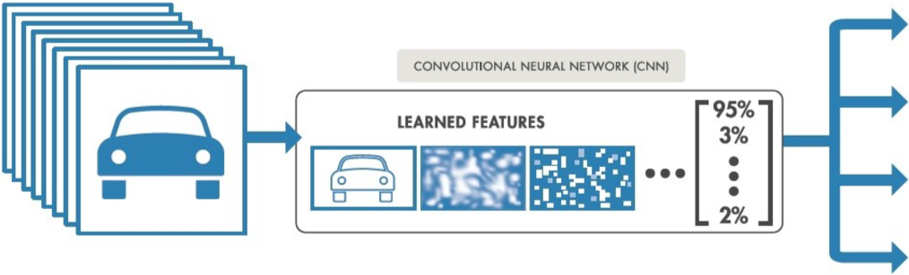
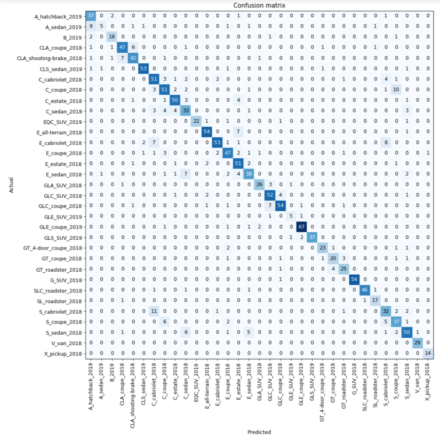

# What Benz
*What Benz* is a deep learning-based solution for recognizing Mercedes Benz cars from pictures taken using a mobile app.

    

## Introduction:
The variety and the similarities between the cars model make recognizing a particular car’s model a challenge for many people. Imagine a scenario where a person sees a car on the street and likes it. The person would take a picture of the vehicle, search for it somewhere on the internet or by asking a car dealer, explore some properties such as the engine, number of sets, possible colors, and finally get immediately informed about the price range for different options. *What Benz* saves you your valuable time and puts all that information just in a few seconds in your hand by just taking a picture of the car.

In this version of the app, we are using two types of approaches:
 - a deep learning model that recognizes the new released Mercedes Benz cars during the last three years
 - an unsupervised learning model that groups the Mercedes Benz cars into different clusters
 
*What Benz* app uses information directly from a production cars' market database. Therefore, the app can provide the user with information about the availability of the vehicle and the selling points in the target market.

Some usecases where *What Benz* app could be used:
 - getting car's details info and store the history of models
 - getting the class of a model
 - getting info about car's availability on the market
 - get the closest car (e.g. take picture of *Tesla* and get a closest model from *Mercedes Benz's* model range)
 - getting closest car's availability info on the market

## How does it work?
It is straight forward. The user runs the app and takes a picture of a car on the street. The app sends a request to the backend where the model runs. The model predicts the most appropriate class of vehicle and sends back to the user the prediction together with all relevant information about the model.

    

## Technical overview:
### Pre-trained model
A standard pre-trained [ResNet34](https://github.com/pytorch/vision/blob/master/torchvision/models/resnet.py) model was used for the *what benz* app. The model was fined tuned using a custom dataset (see below).

This [kaggle kernel](https://www.kaggle.com/jupyternotebook/accuracy-85-with-fast-ai-in-4-epoches) could be an example how to train the a model on the [Standford](https://ai.stanford.edu/~jkrause/cars/car_dataset.html) car dataset, which contains of 16,185 images and 196 classes of cars.

    

### Collecting custom data

For fine-tuning the model on new released Mercedes Benz car, we collected 10000 images for 33 new Benz model classes models. Here [Mercedes Benz developer API](https://developer.mercedes-benz.com/) could be used for fetching data about the existing cars at different European markets. 
The fetched data includes information about the available colors, engine power, fuel types, transmission types, and price range.

### Fine-tuning the model

Fine-tuning is the process in which parameters of a model must be adjusted very precisely in order to fit with the new collected image data.
The model was fined-tuned in two steps:
1. Train the last layer on the new collected images
2. Unfreeze all the layer and train the model on the new collected data

The quality of the fine-tuned model reaches 86% 

    

    

### Serving the model

Fine-tuned model was served using `Azure ML Services`. This [tutorial](https://docs.microsoft.com/en-us/azure/machine-learning/service/how-to-deploy-custom-docker-image) demonstrates how to deploy a model that was trained outside `Azure ML Services`. 
   
## Unsupervised learning model:

K-Means clustering method was used to group the Mercedes Benz cars into different clusters. The clustering was done based on the car's properties such as body type, model, price, etc.

### Future steps

Extending the current solution with additional data sources (about user, location, market, etc.) will enable more use-cases for *What Benz*, for example:
- recommend a specific car based on a history of taken pictures
- predict car availability and inform the user about it
- inform the user about changing a price or discounts for certain car or similar models
- getting the nearest dealer with available cars of this type based on the user's location
- *What Tires* extension. Identify/recommend accessories.

### Tech stack
- Fast.ai, PyTorch
- Azure ML services
- iOS, Android Apps, Web version
- Flutter Framework
- Master Data Integration via API
- Beta build distribution via Testflight & Google Play
